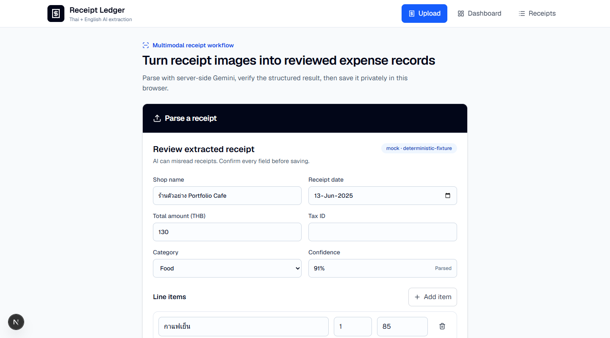
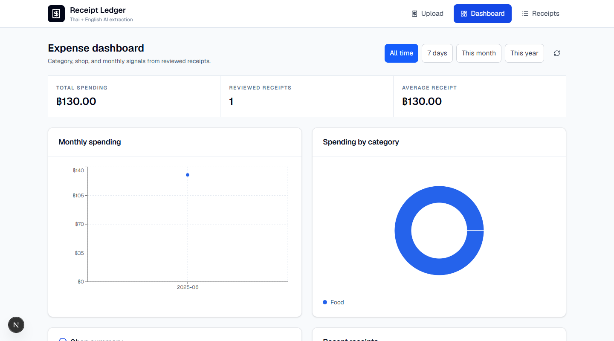

# Receipt AI Expense Tracker

Local-first multimodal expense tracker for Thai and English receipts. The default zero-cost review path returns a deterministic synthetic result without API keys or network AI calls. Optional server-side providers can parse receipt images, users review the structured result, and confirmed receipts stay in the browser through IndexedDB and Dexie.js.

Live deployment: [receipt-ai-expense-tracker-eta.vercel.app](https://receipt-ai-expense-tracker-eta.vercel.app)

The current public deployment uses mock AI until newly rotated provider keys are configured.

## Product Flow

```text
Receipt image
  -> upload validation
  -> POST /api/receipts/parse
  -> mock AI or capability-aware provider routing
  -> Zod validation and Buddhist Era date normalization
  -> editable human review
  -> IndexedDB save
  -> receipt history and dashboard analytics
```

AI parsing never saves automatically. The user confirms the shop, date, items, total, category, tax ID, confidence, and notes before persistence.

## Screenshots

| Upload flow | Expense dashboard |
| --- | --- |
|  |  |

## Tech Stack

| Layer | Technology |
| --- | --- |
| App | Next.js 16, React 19, TypeScript |
| Styling | Tailwind CSS 4 |
| AI | 9arm Gateway, Gemini, Groq, and Cerebras server-side router |
| Validation | Zod plus domain normalization |
| Persistence | IndexedDB through Dexie.js |
| Analytics | Client-side aggregation and Recharts |
| Testing | Vitest, Testing Library, fake-indexeddb |

## Zero-Cost Local Review

```powershell
npm ci
$env:MOCK_AI_MODE="true"
$env:NEXT_PUBLIC_STORAGE_MODE="indexeddb"
npm test
npm run dev
```

Open `http://localhost:3000`. Mock mode uses [`fixtures/synthetic-receipt.json`](fixtures/synthetic-receipt.json), requires no provider key, and makes no external AI call. See [`docs/local_review.md`](docs/local_review.md) for a synthetic placeholder-image command and expected output.

## Environment

Local-first storage requires no database credentials:

```env
NEXT_PUBLIC_STORAGE_MODE=indexeddb
```

Mock mode is the default:

```env
MOCK_AI_MODE=true
```

For optional real receipt parsing, explicitly disable mock mode and configure server-side keys:

```env
MOCK_AI_MODE=false
AI_PROVIDER_PRIORITY=ninearm,gemini,groq,cerebras
NINEARM_API_KEY=
NINEARM_SUPPORTS_IMAGE_INPUT=false
GEMINI_API_KEY=your-newly-rotated-server-key
GEMINI_SUPPORTS_IMAGE_INPUT=true
GROQ_API_KEY=
CEREBRAS_API_KEY=
```

With the default capability flags, 9arm remains first in configured priority but is skipped for image input, so Gemini handles direct receipt extraction. Groq and Cerebras remain available for text/JSON repair. Set `NINEARM_SUPPORTS_IMAGE_INPUT=true` only when the configured 9arm model and gateway actually accept image content.

All provider keys are read only by server modules. Never prefix a provider key with `NEXT_PUBLIC_`. See [`docs/model_routing.md`](docs/model_routing.md) for routing, retry, cache, and degraded-mode behavior.

## Local-First Storage

- Reviewed receipts are written directly to IndexedDB in the current browser profile.
- History and dashboard views subscribe to Dexie live queries.
- Receipt statistics are calculated from the same local records.
- No Supabase project, database migration, account, or service key is required.
- Clearing site data or changing browser profiles removes access to that local ledger.

The app uses a `ReceiptRepository` interface so a synchronized backend can be added later without coupling UI components to a vendor SDK.

Detailed rationale: [`docs/storage_architecture.md`](docs/storage_architecture.md)

Receipt fixture compatibility and expected real-AI checks:
[`docs/extraction_methodology.md`](docs/extraction_methodology.md)

## Deterministic Extraction Evidence

The committed synthetic fixture records the expected merchant, date, currency, line items, subtotal evidence, tax availability, total, category, confidence, and validation warnings. Mock responses are validated through the same normalization code used for provider output.

```powershell
npm test -- src/lib/ai/router.test.ts src/app/api/receipts/parse/route.test.ts
Get-Content fixtures/synthetic-receipt.json
```

No real receipt image, OCR output, bank slip, membership record, or private financial record is required or permitted in the repository.

## API Routes

| Method | Route | Purpose |
| --- | --- | --- |
| `POST` | `/api/receipts/parse` | Validate and parse an image; returns review data only |
| `GET` | `/api/health` | Report non-secret AI routing capabilities and storage mode |

Receipt CRUD and statistics are browser-side operations, not server APIs.

## Receipt Contract

```json
{
  "shop_name": "string",
  "date": "YYYY-MM-DD",
  "items": [
    {
      "name": "string",
      "quantity": 1,
      "unit_price": 0,
      "total_price": 0
    }
  ],
  "total_amount": 0,
  "tax_id": null,
  "category": "food",
  "currency": "THB",
  "confidence": 0.9,
  "notes": ""
}
```

Buddhist Era years such as `2568` normalize to `2025`. Short Thai years are converted only for the cautious `60-99` range. Impossible dates and negative totals fail validation.

## Verification

```powershell
npm ci
npm run lint
npm test
npm run build
python scripts/test_repo_guardrails.py
python scripts/check_repo_guardrails.py
```

Automated coverage includes:

- Thai Buddhist Era and invalid-date normalization
- structured receipt validation
- provider priority, capability filtering, retry, cache, and fallback behavior
- mock parse API behavior
- IndexedDB repository CRUD and live observation
- local stats aggregation
- upload, review, and explicit local save

## Security

- Receipt images reach the server only for parsing.
- Mock mode is the default and does not send images to external AI providers.
- AI provider credentials remain server-side.
- The parse endpoint returns data but does not persist it.
- Real receipts, uploads, OCR output, local databases, and environment files are ignored and rejected by repository guardrails.
- Local IndexedDB records are not encrypted by this app.
- Do not upload sensitive receipts to a public deployment.

This portfolio demo is decision-support only. It is not accounting or tax advice, has not received a compliance audit, and does not guarantee financial accuracy.

## Known Limitations

- Data is local to one browser profile and is not synchronized or backed up.
- Stored base64 images can consume browser quota faster than text-only records.
- No user authentication, cloud sync, export/import, or multi-device support.
- Direct image parsing requires at least one configured image-capable provider unless mock mode is enabled.
- The deterministic fixture demonstrates pipeline behavior, not OCR accuracy on real documents.
- The filesystem parse cache is local to one server instance and is not shared across deployments.
- Short two-digit Thai years below `60` require manual review because they are ambiguous.

## Portfolio Review

See [`docs/portfolio_review.md`](docs/portfolio_review.md) for the exact reviewer flow and [`docs/extraction_methodology.md`](docs/extraction_methodology.md) for validation limits.

## License

MIT
